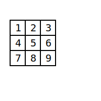
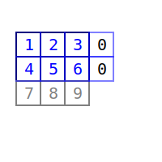
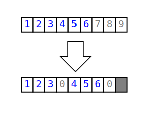
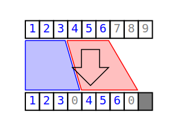
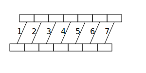
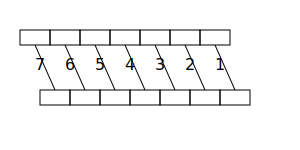
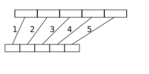

# Reshaping

> Note: this might not be the best algorithm in terms of number of swaps, but is quite simple to understand and implement. And it also requires at most N (number of elements in the tensor) swaps and O(1) memory.

We have a tensor, and we want to reshape it.

Suppose we have a 3x3 matrix:



We can reshape it to a 2x4 matrix:



The flatten view of the internal data vector is:



We obviously don't want to create a different array and then copy the data over. We want to do this in-place.

We can do this with a `reshape` method like this:
```cpp
void reshape(...) {
    const size_t old_size = ...;
    const size_t new_size = ...;
    const bool preResize = new_size > old_size;

    if (preResize)
        data.resize(new_size);

    // ... reorganize data...

    if (!preResize)
        data.resize(new_size);
}
```
But how do we reorganize the data?

We start by iterating over the first free index, for each one, the rest of the free indexes represent a sub tensor of rank `rank() - 1`, whose elements are contiguous. We call this a *block*. Eon each block we can apply the same algorithm recursively until we reach a rank 0, which is just a scalar.

In the example above, we consider the blocks identified by the first index (i.e. the rows):



Now, since the input and output data vector is the same, we need to be careful not to overwrite the data we haven't read yet. We can do this by iterating over the blocks in some particular order. The rest of the document will describe how to do this.

## Order of iteration

We identify 3 cases for the order of iteration:
1. The out block has the same size as the in block (*shift* case)
2. The out block is smaller than the in block (*reduction* case)
3. The out block is larger than the in block (*expansion* case)

### Shift case

This is the simplest case: we can move the data over with a single pass (might be reversed depending on the input and output positions).

#### LR

> TODO in all the figures, represent the empty tail of zeros

If the output block is at a lower position than the input block, we can iterate over the blocks in the same order as the input data vector.



This will guarantee that we don't overwrite the data we haven't read yet.

<!-- copilot img src="https://render.githubusercontent.com/render/math?math=\begin{aligned} &\text{in} = \begin{bmatrix} 1 & 2 & 3 \\ 4 & 5 & 6 \\ 7 & 8 & 9 \end{bmatrix} \\ &\text{out} = \begin{bmatrix} 1 & 2 & 3 & 4 \\ 5 & 6 & 7 & 8 \end{bmatrix} \\ &\text{in order} = \begin{bmatrix} 1 & 2 & 3 \\ 4 & 5 & 6 \\ 7 & 8 & 9 \end{bmatrix} \\ &\text{out order} = \begin{bmatrix} 1 & 2 & 3 & 4 \\ 5 & 6 & 7 & 8 \end{bmatrix} \end{aligned}"-->

#### RL

If the output block is at a higher position than the input block, we can iterate over the blocks in the reverse order as the input data vector.



> TODO maybe std::copy, rotate, move or something else altready exists in the standard library

### Reduction case

This is the most complex case.

#### LR

If the output block is at a lower position than the input block, we can iterate over the blocks in the same order as the input data vector.



#### RL

If the output block is at a higher position than the input block, we can iterate over the blocks in the reverse order as the input data vector.

> TODO figure


> TODO: continue...

<!--```rust
let mut tensor = Tensor::from(vec![1, 2, 3, 4, 5, 6, 7, 8, 9]);
tensor.reshape(&[2, 4]);
```-->
